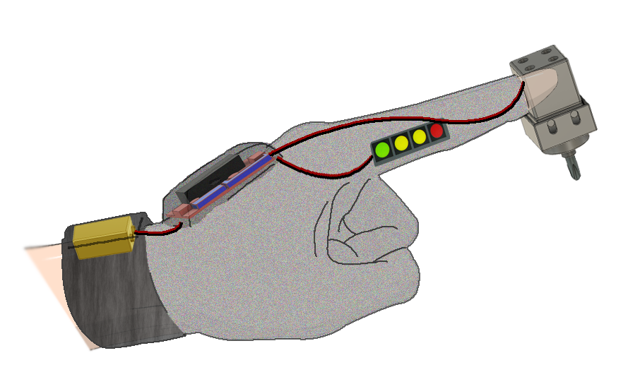
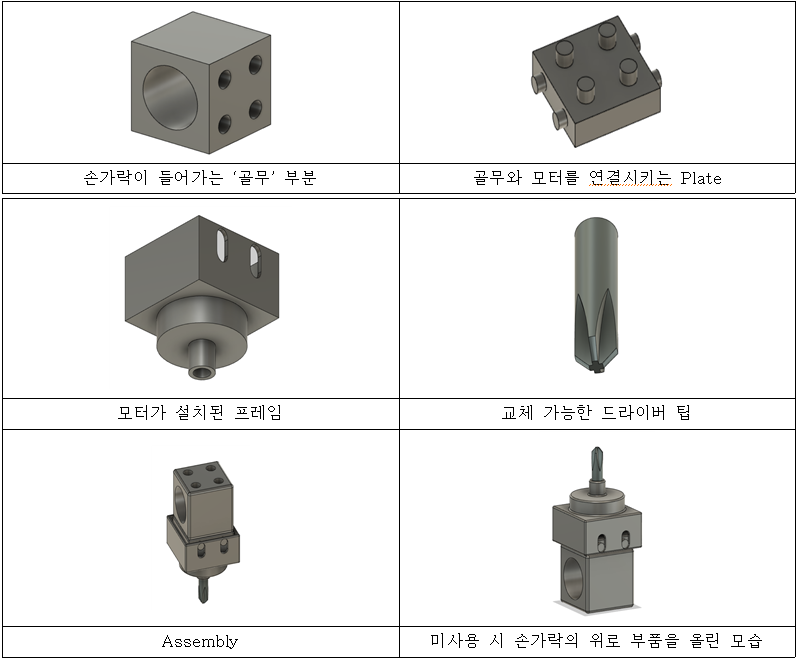

# 내 손을 잡아 (Hold My Hands)
### 고려대학교 기계공학부  
##### 2017170601 공성식  2017170631 조상훈  
##### 2017170645 구보람  2017170712 김형빈  

## 1. 설계의 목적
이 설계의 총체적 목적은 노트북 수리와 같은 human-scale의 수리 환경에서 반복적인 작업 동작 요소를 줄이기 위한 드라이버를 제작함에 있다. 공구 요소를 장갑형으로 개선해 한 손 조작이 가능한 wearable 전동 드라이버를 제작하여 수리 작업의 효율성을 높인다.
설계를 통한 예상 효율은 다음과 같다.
* 작업 장비 교체 소요 축소
* 손의 피로도 감소
* 작업 환경의 규모를 고려한 장비
#### 설계 필요의 정합성
* 기술의 발달로 인한 전자제품의 수요증가는 꾸준했으나, 최근 AI 기술로 인한 전자제품의 기능 다양화 현상과 더불어 코로나-19로 인해 그 수요는 더욱 폭발적으로 증가함
* 코로나-19로 인해 공공위생과 의료산업에 비상상황이 지속되면서 이러한 경향이 이어질 것으로 시사됨
## 2. 설계 핵심 내용
### 하드웨어 부분
    
사진과 같이 장갑에 제어장치와 드라이버를 부착하였다. 이 설계 방식의 목적은 한 손에 자유를 부여하기 위해 다른 한 손으로 드라이버의 모든 구동을 이끌어낼 수 있게 한다.    
이를 중심으로 구동 방식을 구상했다.    
* 구동 방식
  * 멤브레인 스위치를 검지 옆에 부착하여 엄지만으로 드라이버를 구동시킨다.
* 설계 고려 사항
  * 레고 결합방식: 3방향 팁 부착 및 탈부착/고정력 고려
  * 라텍스(스폰지)를 이용한 진동 제어
  * 스위치: CW / OFF / CCW
### 회로 및 제어 부분
* RaspberryPi Zero와  2A L298N 모터 드라이버를  사용하여 PWM (Pulse-Width Modulation)방식으로 DC모터의 토크, 각속도, 회전 방향등을 조절할 수 있는 [소스코드](https://github.com/skykongkong8/MotorControl)
* 멤브레인 스위치 인터페이스를 바탕으로 DC 모터의 전원, 회전 방향, 등을 컨트롤할 수 있는 회로 	설계 및 제작
* 3M 라텍스 장갑 위에 회로도를 얹어 사용자가 사용할 시 불편함이 없는 구성을 지니도록 설계

## 3. 참고문헌
* Medical Equipment Maintenance Market Size, Share & Trends Analysis Report By Equipment (Imaging Equipment, Surgical Instruments), By Service (Corrective Maintenance, Preventive Maintenance), And Segment Forecasts, 2021 - 2027

* Electronic Equipment Repair Service Market Research Report by Product, by End Use, by Region - Global Forecast to 2026 - Cumulative Impact of COVID-19

* Electronic and Precision Equipment Repair and Maintenance Global Market Report 2021: COVID-19 Impact and Recovery to 2030

* “서비스업조사보고서 : 2018년 기준 서비스업조사보고서 / 통계표 / S 수리 및 기타개인 서비스업 / 3. 산업 및 정기 휴무일수별 사업체수.” (2021년05월1일). 
  [KOSIS](http://kostat.go.kr/wnsearch/search.jsp)

* Callister. Fundamentals of Materials Science and Engineering. Wiley. 2017
